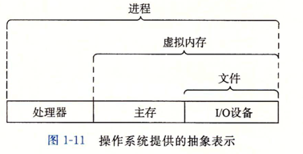

# CSAPP-Read
阅读笔记-深入理解计算机系统
.png) 

## 第1章 计算机系统漫游
一个hello world程序的生命周期就是从一个源程序开始的。 
源程序实际上就是一个由值0和1组成的位(又称比特)序列，8个位被组织称一组，称为字节。每个字节表示程序中的某些文本字符。 
大部分计算机都使用ASCII标准来表示文本字符。（就是用一个唯一都单字节大小的整数值来表示每个字符） 
hello world程序是以字节序列的方式储存在文件中的，注意，每个文本行都是以一个看不见的换行符\n来结束的，对应的整数值是10。 
像hello world程序这样只由ASCII字符构成的文件称为文本文件，所有其他文件都称为二进制文件。 
hello world程序表明一个基本思想：系统中所有的信息，都是由一串比特表示的。 
 
系统的硬件组成： 
 
1.总线：贯穿整个系统的是一组电子管道，称作总线，它携带信息字节并负责在各个部件间传递。通常总线被设计成传送定长的字节块，也就是字。
字中的字节数(即字长)是一个基本的系统参数，现在大多数机器字长要么是4个字节(32位)，要么8个字节(64位)。 
2.I/O设备：I/O(输入/输出)设备是系统与外部世界的连接通道。上图中包括四个I/O设备：作为用户输入的鼠标和键盘，作为用户输出的显示器，
以及用于长期存储数据的磁盘驱动器(简单说就是磁盘)。每个I/O设备都是通过一个控制器或适配器与I/O总线相连，
无论如何，控制器和适配器的功能都是在I/O总线和I/O设备之间传递信息。 
3.主存：主存是一个临时存储设备，在处理器执行程序时，用来存放程序和程序处理的数据。
从物理上讲，主存是由一组动态随机存取存储器(DRAM)芯片组成的。
从逻辑上讲，存储器是一个线性的字节数组，每个字节都有唯一的地址。一般来说，组成程序的每条机器指令都是由不同数量的字节构成 
4.处理器：中央处理单元(CPU)，简称处理器。解释(或执行)存储在主存中指令的引擎。
从系统通电，到断电，处理器一直在不断执行程序计数器指向的指令，再更新程序计数器，使其指向下一条指令。 
 
 
高速缓存的重要性： 
一个hello程序的机器指令最初存放在磁盘上，当程序加载时，需要被复制到主存，当处理器运行程序时，指令又从主存复制到处理器。这些复制就是开销。 
设计者设计了一个高速缓存存储器(cache memory，简称cache或高速缓存)，存放处理器近期可能会需要的信息。 
 
位于处理器上的L1高速缓存器容量可达数万字节，访问速度和访问寄存器文件一样快。
一个容量为数十万到数百万的更大的L2高速缓存通过一条特殊的总线连接到处理器。
进程访问L2比访问L1的时间长5倍，但是这仍比访问主存的时间快上5～10倍。有的系统甚至有三级高速缓存L3. 
 
 
 
 
进程：进程就是操作系统对一个正在运行的程序的一种抽象。 
操作系统保持跟踪进程运行所需的所有状态信息，这种状态，也就是上下文，包括许多信息，比如PC和寄存器文件的当前值，以及主存的内容。 
在任何时刻，单处理器系统都只能执行一个进程的代码。当操作系统决定把控制权从当前进程新进程时，就会进行上下文切换，即保存当前进程的上下文、恢复新进程的上下文，然后将控制权传递到新进程。 
一个进程到另一个进程的转换是由操作系统的内核(kernel)管理的，内核是操作系统代码常驻主存的部分。
当应用程序需要操作系统的某些操作时，比如读写文件，它就执行一条特殊的系统调用(system call)指令，将控制权传递给内核。
然后内核执行被请求的操作并返回给应用程序。注意：内核不是一个独立的进程，相反，是系统管理全部进程所用代码和数据结构的集合。 
线程：进程的执行单元 
虚拟内存：虚拟内存是一个抽象概念，它为每个进程提供一个假象，即每个进程都在独占的使用主存。每个进程看到的内存都是一致的，称为虚拟地址空间。 
文件：就是字节序列。每个IO设备，都可以看成是文件。
系统中所有的输入输出都是通过使用以小组称为Unix I/O的系统函数调用读写文件来实现的。 
 
 
 
## 第2章 信息第表示和处理
大多数计算机使用8位的块，或者字节，作为最小的可寻址的内存单位，而不是访问内存中单独的位 
十六进制(简写为hex)，以0x开头的数字常量被认为是十六进制的值。 
当x=2^n时，可以很容易将x写成十六进制，n可以表示成i+4j，其中0<=i<=3，
可以把x写成开头的十六进制数字为1(i=0)、2(i=1)、4(i=2)、8(i=3)，后面跟随j个十六进制的0。
例子：2048=2^11，有n=3+4*2，从而十六进制表示0x800 
 
## 第3章 程序第机器级表示
栈帧：当x86-64过程需要的存储空间超过寄存器能够存放的大小时，就会在栈上分配空间，这个部分称为过程的栈帧(stack frame) 
CPU 访问内存时，并不是逐个字节访问，而是以字长（word size）为单位访问。内存对齐，减少 CPU 访问内存的次数 
 
## 第4章 处理器体系结构
 

## 第5章 优化程序性能
 

## 第6章 存储器层次结构
访问主存：数据流通过称为总线(bus)的共享电子电路在处理器和DRAM主存之间来来回回。 
每次CPU和主存之间的数据传送都是通过一系列步骤来完成的，这些步骤称为总线事物(bus transaction)。 
读事物从主存传送数据到CPU，写事物从CPU传送数据到主存。 
高速缓存是基于SRAM的。 
 

## 第7章 链接
 

## 第8章 异常控制流
 

## 第9章 虚拟内存
 

## 第10章 系统级I/O
 

## 第11章 网络编程
 

## 第12章 并发编程
